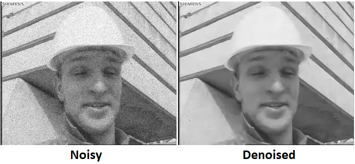

# Block-matching based single model denoiser using Keras and TensorFlow

This is an implementation of block-matching CNN based image denoiser *BMCNN* using Python 3, Keras, and TensorFlow. 
This work is similar to [IRCNN](https://arxiv.org/abs/1704.03264). 
The differences are:
1. Prior to denoising, a block matching algorithm searches for similar blocks. For each 4x4 block, 4 similar blocks are found. 
Thus, an image with 5 channels (one original and 4 similar blocks) are fed into the network. 

2. We use a lighter network. Since the block matching already does some of the processing we can use a simpler network with a fewer number of filters.

3. Unlike most of CNN based denoisers that for noise sigma specific weights are required, *BMCNN* uses single model (fixed weight) for all noise levels.

The repository includes:
* Source code of BMCNN.
* Block-Matching code
* Pre-trained weights BMCNN
* Jupyter notebooks to visualize the denoising results

# Getting Started
* [demo.ipynb](samples/demo.ipynb) Is the fastest way to start. 
It shows an example of using a model pre-trained for variation of noise levels.
It includes code to run the denoiser on arbitrary images and different noise levels.

* [model.py](bmcnn/model.py): This file contains the main BMCNN implementation.

* [utils.py](bmcnn/utils.py): This file contains some noise related functions.

## Installation
1. Install dependencies

   pip3 install package [numpy, keras, skimage, ...]

2. Clone this repository

3. Run setup from the `libs` directory
    
    python3 setup.py install
     